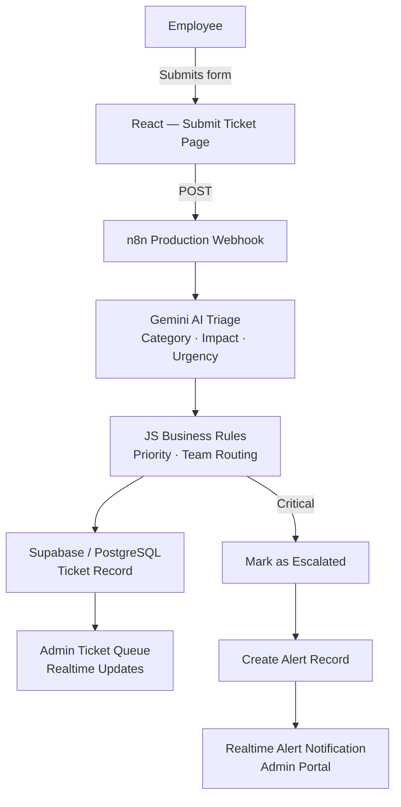
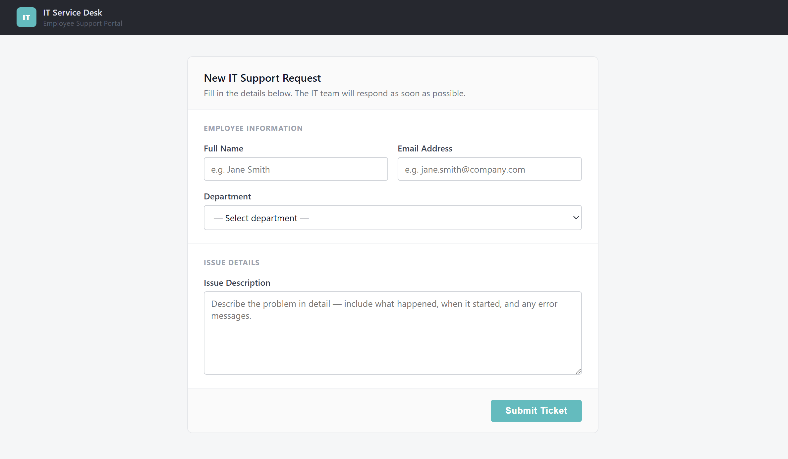
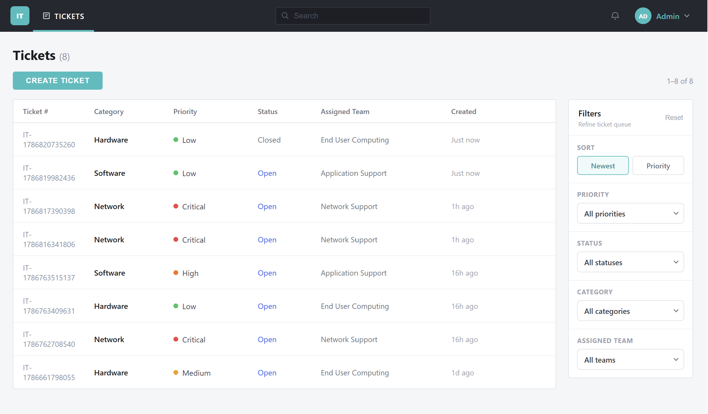
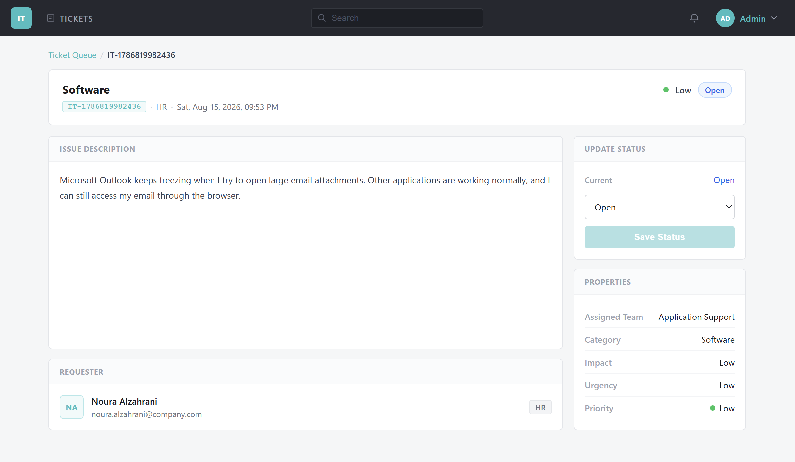
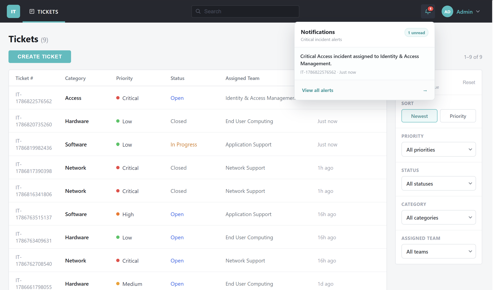
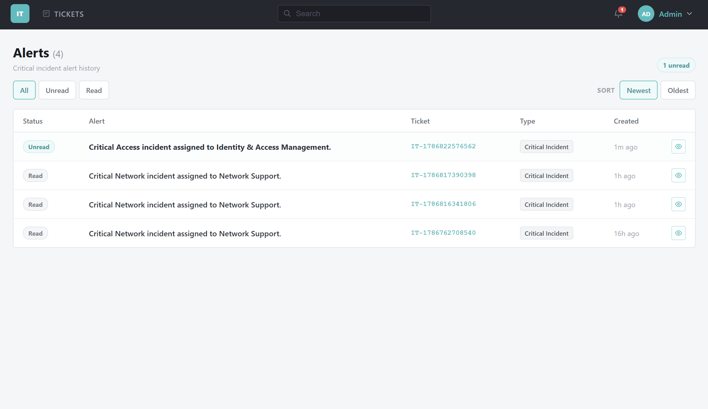
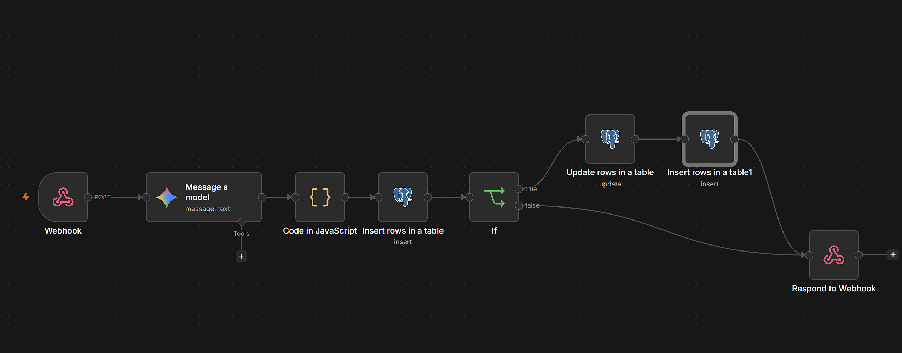

# AI-Assisted IT Service Desk Automation

A realistic internal IT support workflow that combines a React frontend, n8n automation, Gemini AI triage, and Supabase for storage and realtime updates. Employees submit IT issues through a public form; an automated backend pipeline classifies, prioritises, routes, and stores each ticket — with critical incidents triggering an escalation flow and live admin notifications.

> **Note:** This project is currently configured for local development and demonstration. The React frontend and n8n automation run locally, while Supabase provides the hosted database, authentication, and realtime services. The project focuses on demonstrating the system architecture, automation workflow, AI-assisted triage, and end-to-end ticket management logic.


---

## How It Works

When an employee submits a ticket, the request is sent to an n8n production webhook. n8n passes the issue description to Google Gemini, which returns a structured classification (category, impact, urgency). Deterministic JavaScript rules inside the n8n workflow then calculate the final priority and assign the correct support team. The completed ticket record is written to Supabase/PostgreSQL. If the ticket is Critical, a second branch marks it as escalated and inserts a record into the alerts table. The admin portal receives both updates in realtime via Supabase Realtime subscriptions.



---

## Key Features

**Employee side (public)**
- Ticket submission form with validation
- Sends directly to n8n webhook — no direct database access from the client

**Admin side (protected)**
- Login via Supabase Auth
- Ticket queue with search, sorting, and filters (Priority, Status, Category, Assigned Team)
- Ticket detail view with status updates and delete with confirmation
- Realtime ticket updates via Supabase Realtime
- Realtime critical alert notifications with alert history
- Logout
- Row Level Security policies restricting admin data

---

## AI + Business Logic

Gemini handles the natural-language part: reading a free-text issue description and returning structured fields for category, impact, and urgency. Everything after that is deterministic.

**Category → Assigned Team**

| Category | Assigned Team |
|---|---|
| Network & Connectivity | Network Operations |
| Hardware | End-User Support |
| Software & Licensing | Software Management |
| Access & Permissions | Identity & Access |
| Server & Infrastructure | Infrastructure |
| Other | Service Desk |

**Priority — Impact × Urgency matrix**

|  | Low Urgency | Medium Urgency | High Urgency |
|---|---|---|---|
| **Low Impact** | Low | Low | Medium |
| **Medium Impact** | Low | Medium | High |
| **High Impact** | Medium | High | Critical |

This separation keeps the system predictable. The LLM understands language; the rules make the decisions. Priority and routing cannot drift based on how the model phrases a response.

---

## Critical Incident Escalation

When business rules produce a Critical priority ticket, n8n runs an escalation branch that:

1. Sets `is_escalated = true` and records `escalated_at` on the ticket.
2. Inserts a row into the `alerts` table with the ticket reference and timestamp.
3. The admin portal's Supabase Realtime subscription picks up the new alert and displays a live notification. Alert history is also available in a dedicated view.

---

## Screenshots

### Employee Ticket Submission


### Ticket Queue


### Ticket Details


### Critical Alert Notification


### Alert History


### n8n Automation Workflow


---

## Tech Stack

**Frontend**
- React, Vite, React Router

**Automation / AI**
- n8n (workflow automation)
- Google Gemini (AI triage)
- JavaScript business rules (priority + routing)

**Backend / Data**
- Supabase (PostgreSQL, Auth, Realtime)

---

## Security

- The ticket submission route is public; all admin routes are protected by Supabase Auth.
- PostgreSQL Row Level Security (RLS) policies restrict data access at the database level.
- All credentials and API keys are stored in a `.env` file and excluded from version control via `.gitignore`.
- No secrets are committed to the repository.

---

## Project Structure

```
src/
├── components/       # Shared UI components (TopNav, Sidebar, Badge, ProtectedRoute)
├── data/             # Constants (statuses, priorities, categories, teams)
├── pages/            # Route-level pages (Login, TicketQueue, TicketDetail, SubmitTicket)
└── services/         # Supabase client and data access functions
```

---

## Setup

1. Clone the repository
2. `npm install`
3. Create a `.env` file in the project root:

```
VITE_N8N_WEBHOOK_URL=
VITE_SUPABASE_URL=
VITE_SUPABASE_PUBLISHABLE_KEY=
```

4. `npm run dev`

The n8n workflow must be configured separately with its own credentials for the Gemini API and Supabase connection.

---

## Testing / Workflow Validation

The system was tested end-to-end with Low, Medium, High, and Critical incident scenarios and validated for: ticket creation, database persistence, AI classification, priority routing, escalation, realtime ticket updates, realtime alert notifications, status updates, ticket deletion, and protected route enforcement.

---

## Future Improvements

- SLA tracking and breach notifications
- Role-based access for multiple IT teams
- Audit log for ticket state changes
- Advanced incident analytics and reporting

---

